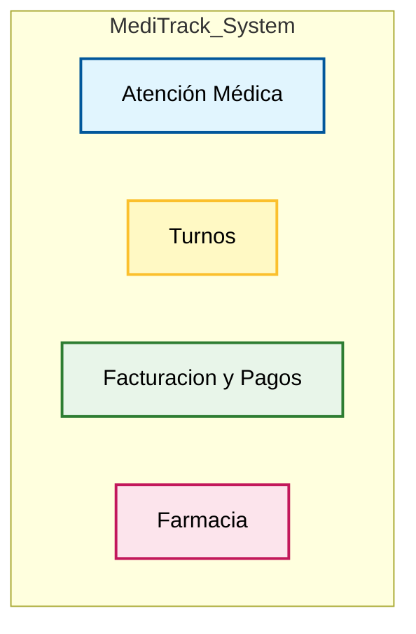
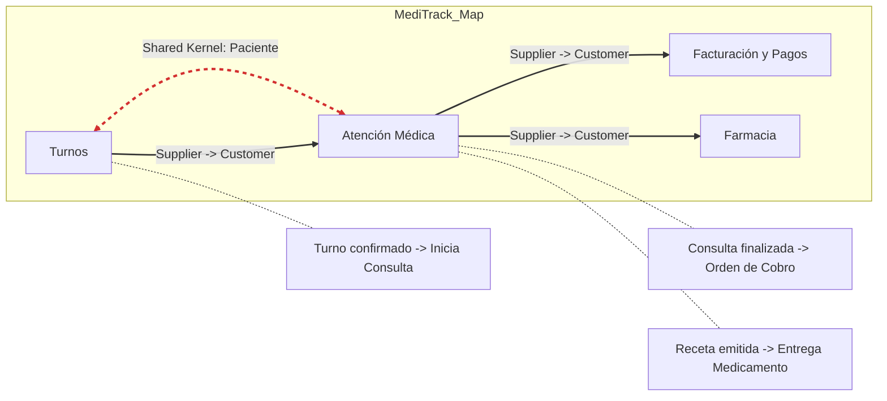

# Practical Assignment: Strategic DDD - System Architecture Design

**Objective**: Demonstrate understanding of Domain-Driven Design (DDD) Strategic patterns by analyzing a business case, making informed architectural decisions, and identifying Bounded Contexts.

---

## Part 1: Architectural Decision

**Task**: Decide whether the system should be built as a **Monolith** or **Microservices** architecture.

> **Constraints**:
> *   Team Size: 5 developers
> *   Budget: Limited (early-stage startup)
> *   Timeline: 6 months for MVP
> *   Expected Users: 50 clinics in first year

### Your Answer

**ARCHITECTURAL DECISION**: `[ MONOLITO ]` (Monolith / Microservices)

**ARGUMENTS**:

1.  **Equipo de desarrollo**
    *   Al ser un equipo de desarrollo de 5 personas, es más eficiente y rápido desarrollar un monolito que un microservicio. Ya que los tiempos de configuracion y despliegue de microservicios son mucho mayores que los de un monolito. Y al ser un equipo acotado, es preferible optar por un monolito que es mas facil configurarlo y desplegarlo. Mientras que el microservicio te agrega complejidad desde el dia 1.

2.  **Tiempo de desarrollo**
    *   Al optar por un monolito se ajusta mas a los plazos de entrega de 6 meses como esta propuesto, ya que la mayor parte del tiempo se lo utiliza para el desarrollo y no tanto para configurar y desplegar el servicio.

3.  **Consumo del servicio**
    *   Al tener un estimativo de la cantidad de personas que van a consumir el servicio (50 clinicas) es mas eficiente optar por un monolito ya que el consumo del servicio es mas simple y mas rapido de implementar. Al ser un monolito las comunicaciones entre modulos son instantaneas y no requieren de un tiempo de espera como en el caso de los microservicios(Latencia).

---

## Part 2: Bounded Context Identification

**Task**: Divide the system into Bounded Contexts based on business capabilities.

> **Key Questions**:
> *   Which business capabilities are naturally related?
> *   Which areas have their own specialized vocabulary?
> *   Which parts could evolve independently?

### Your Answer

**Identified Bounded Contexts**:

*   **Context 1**: [Atencion Médica]
    *   *Capabilities*: Consultas, Diagnostico, Historial Clinico
*   **Context 2**: [Turnos]
    *   *Capabilities*: Reserva de turnos, confirmacion de turnos, cancelacion de turnos
*   **Context 3**: [Facturacion y Pagos]
    *   *Capabilities*: Facturacion, pagos, descuentos
*   **Context 4**: [Farmacia]
    *   *Capabilities*: Medicamentos, recetas, control de stock

---

## Part 3: Ubiquitous Language & Context Map

### Part 3A: Ubiquitous Language

**Task**: Define 3-5 key terms for each identified Bounded Context.

### Your Answer

**Context: [Atención Médica]**
*   **Consulta**: Encuentro entre el paciente y el médico para evaluación.
*   **Diagnóstico**: Identificación de la enfermedad o trastorno que causa los síntomas del paciente.
*   **Historial Clínico**: Registro cronológico de la salud del paciente y antecedentes médicos.

**Context: [Turnos]**
*   **Turno**: Slot de fecha y hora asignado para una consulta con un profesional específico.
*   **Agenda**: Calendario de disponibilidad de los médicos.
*   **Confirmación**: Acción explícita del paciente ratificando su asistencia.
*   **Cancelación**: Anulación del turno reservado liberando el espacio en la agenda.

**Context: [Facturación y Pagos]**
*   **Factura**: Documento fiscal emitido por las prestaciones brindadas.
*   **Orden de Cobro**: Registro interno que inicia el proceso de facturación a una obra social.
*   **Liquidación**: Proceso de cobro efectivo de las facturas emitidas a las obras sociales.

**Context: [Farmacia]**
*   **Medicamento**: Producto farmacéutico disponible para la dispensa.
*   **Receta**: Orden médica (digital) que autoriza la dispensa de medicación.
*   **Stock**: Cantidad física disponible de cada medicamento en el inventario.

### Part 3B: Context Map

**Task**: Draw a Context Map showing relationships (Customer/Supplier, Shared Kernel, ACL).

### Your Answer

**Relationships**:

*   **[Atención Médica]** <-> **[Turnos]**: Shared Kernel
    *   *Reason*: Ambos contextos comparten la definición y datos básicos de la entidad **Paciente**. Al ser un equipo pequeño, se decide compartir este subconjunto del modelo (DNI, Nombre, Cobertura) para evitar duplicación y complejidad de sincronización en el MVP.

*   **[Atención Médica]** -> **[Turnos]**: Customer/Supplier
    *   *Reason*: El contexto de **Atención Médica** (Customer) depende de **Turnos** (Supplier) porque para iniciar una consulta médica es requisito indispensable que exista un turno previamente otorgado y confirmado. La consulta consume la información del paciente y horario reservado.

*   **[Facturación y Pagos]** -> **[Atención Médica]**: Customer/Supplier
    *   *Reason*: **Facturación** (Customer) necesita recibir la información de la consulta finalizada (diagnóstico, prestaciones realizadas) desde **Atención Médica** (Supplier) para poder generar la factura correspondiente a la obra social o paciente.

*   **[Farmacia]** -> **[Atención Médica]**: Customer/Supplier
    *   *Reason*: **Farmacia** (Customer) requiere la receta digital generada en **Atención Médica** (Supplier) para validar y dispensar los medicamentos. Sin la confirmación médica, no hay dispensa.

